# 云连接权限策略配置示例

本章节指不同类型的用户根据实际使用场景配置云连接权限策略。

## 示例1：非企业项目的子帐户使用云连接全部功能

根据业务需要，非企业项目子帐户希望使用云连接服务的全部功能，包括云连接、网络实例、带宽包、域间带宽、路由信息、跨帐号和跨境申请等。

具体配置如下：

1.  登录管理控制台。
2.  在系统首页，鼠标移至右上角用户名，选择下拉菜单中的“统一身份认证”。

    **图 1**  统一身份认证  
    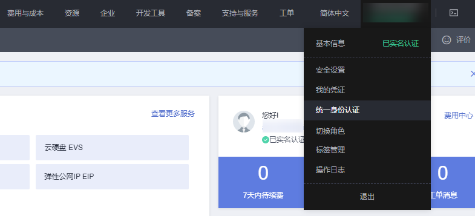

3.  在页面左侧目录中，选择“用户组”。
4.  在用户组页面，单击右上角“创建用户组”。

    **图 2**  创建用户组  
    

5.  根据界面提示配置相关参数，单击“确定”。

    **图 3**  配置用户组参数  
    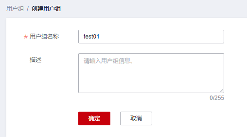

6.  单击用户组名称，进入已创建成功的用户组。
7.  在页面右侧选择“IAM项目视图”，单击“授权”。

    **图 4**  用户组授权  
    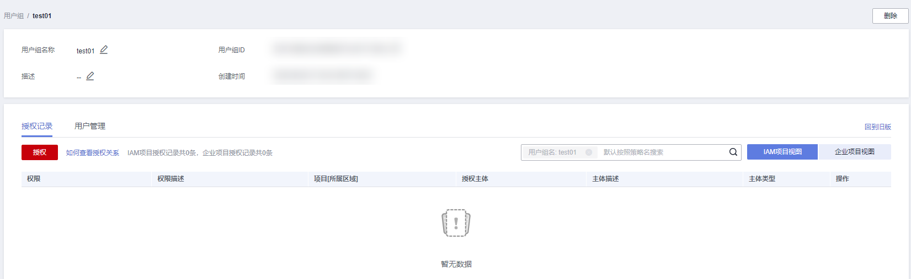

8.  在授权页面右侧搜索框中输入“Cross Connect Administrator”并搜索。
9.  在搜索结果中，勾选系统角色“Cross Connect Administrator”，单击“下一步”。

    **图 5**  选择系统角色  
    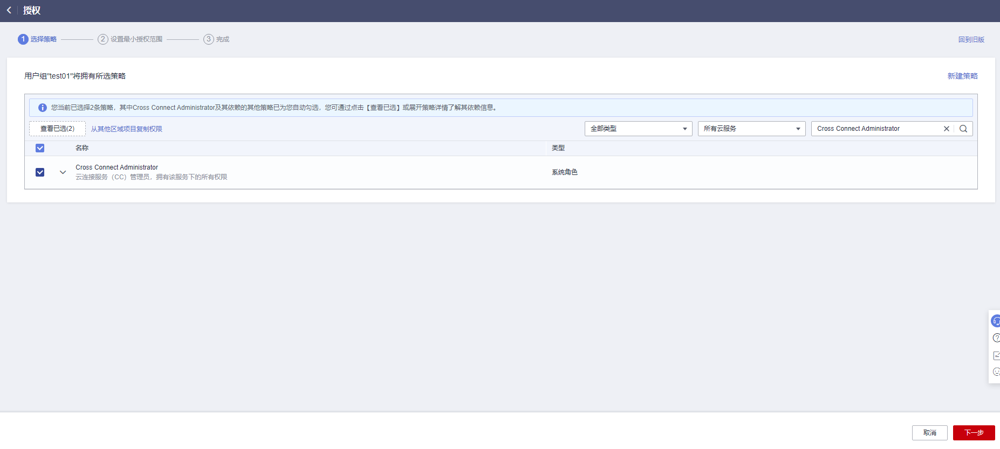

10. 单击“展开其他方案”。

    **图 6**  选择授权范围方案  
    

11. 选择“全局服务资源”，单击“确定”。

    **图 7**  设置最小授权范围  
    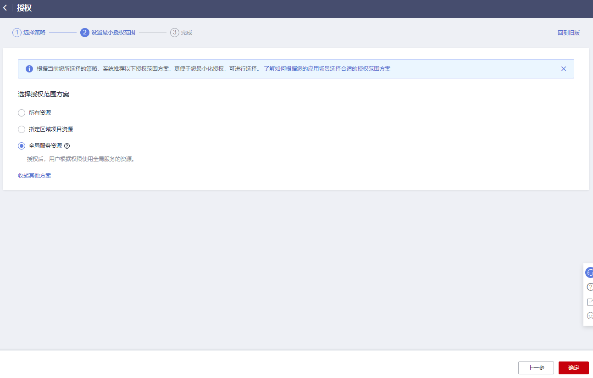

    > **说明：** 
    >授权后需等待15-30分钟后生效，页面提示“授权成功”，则表示已完成用户组授权。
    >**图 8**  授权成功  
    >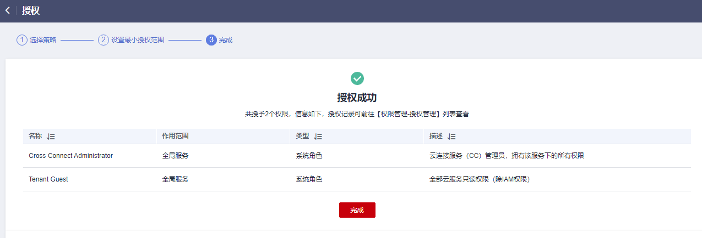

12. 返回用户组列表，在已授权的用户组所在行的操作列，单击“用户组管理”。

    **图 9**  用户组管理  
    

13. 根据界面提示勾选目标用户加入当前用户组，单击“确定”。

## 示例2：授权子帐户使用所有企业项目中的云连接服务

根据业务需要，子帐户需要使用所有企业项目中云连接服务的云连接实例、网络实例、带宽包、域间带宽和路由信息功能，可参考如下步骤进行配置。

如需使用跨帐号、跨境申请功能，请参见[示例1：非企业项目的子帐户使用云连接全部功能](#section1452815719458)。

1.  登录管理控制台。
2.  在系统首页，鼠标移至右上角用户名，选择下拉菜单中的“统一身份认证”。

    **图 10**  统一身份认证  
    

3.  在页面左侧目录中，选择“用户组”。
4.  在用户组页面，单击右上角“创建用户组”。

    **图 11**  创建用户组  
    

5.  根据界面提示配置相关参数，单击“确定”。

    **图 12**  配置用户组参数  
    

6.  单击用户组名称，进入已创建成功的用户组。
7.  在页面右侧选择“IAM项目视图”，单击“授权”。

    **图 13**  用户组授权  
    

8.  在授权页面右侧搜索框中输入“CC FullAccess”并搜索。
9.  在搜索结果中，勾选系统角色“CC FullAccess”，单击“下一步”。

    **图 14**  选择系统策略  
    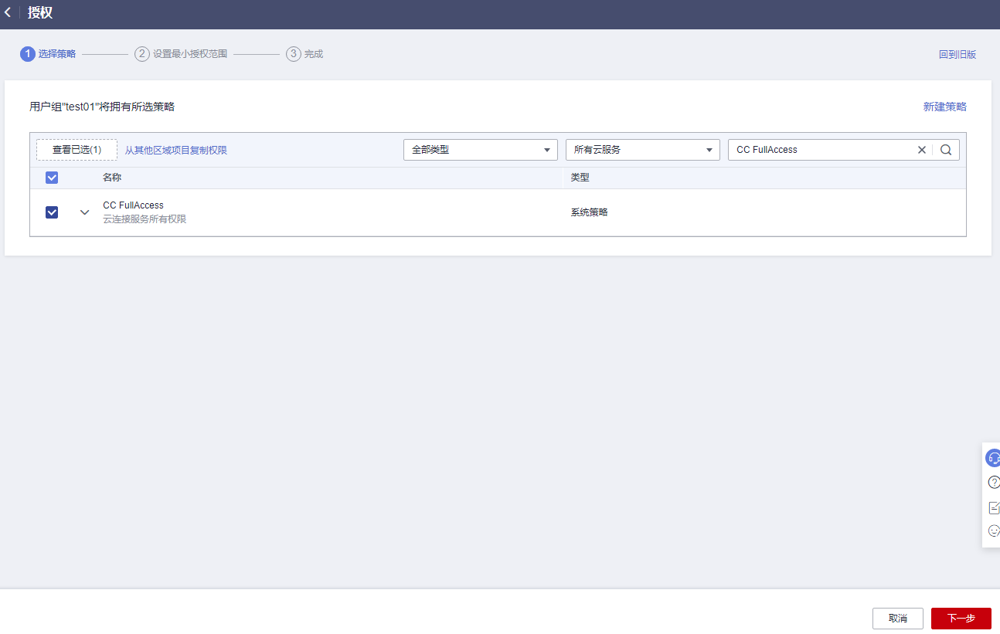

10. 单击“展开其他方案”。

    **图 15**  选择授权范围方案  
    

11. 选择“全局服务资源”，单击“确定”。

    **图 16**  设置最小授权范围  
    

12. 返回用户组列表，在已授权的用户组所在行的操作列，单击“用户组管理”。

    **图 17**  用户组管理  
    

13. 根据界面提示勾选目标用户加入当前用户组，单击“确定”。

    > **说明：** 
    >如果当前子帐户不包含VPC资源相关权限，可以为用户组再配置一个“CC Network Depend QueryAccess”权限，最小授权范围请选择“所有资源”。
    >可以在用户组授权记录中查看相关授权信息。
    >**图 18**  授权记录  
    >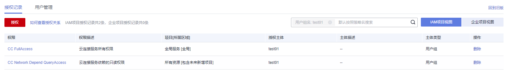

## 示例3：授权子帐户使用指定企业项目的云连接服务

根据业务需要，子帐户需要使用指定企业项目中云连接服务的云连接实例、网络实例、带宽包、域间带宽和路由信息功能，可参考如下步骤进行配置。

如需使用跨帐号、跨境申请功能，请参见[示例1：非企业项目的子帐户使用云连接全部功能](#section1452815719458)。

1.  登录管理控制台。
2.  在系统首页，鼠标移至右上角用户名，选择下拉菜单中的“统一身份认证”。

    **图 19**  统一身份认证  
    

3.  在页面左侧目录中，选择“用户组”。
4.  在用户组页面，单击右上角“创建用户组”。

    **图 20**  创建用户组  
    

5.  根据界面提示配置相关参数，单击“确定”。

    **图 21**  配置用户组参数  
    

6.  单击用户组名称，进入已创建成功的用户组。
7.  在页面右侧选择“IAM项目视图”，单击“授权”。

    **图 22**  用户组授权  
    

8.  在授权页面右侧搜索框中输入“CC FullAccess”并搜索。
9.  在搜索结果中，勾选系统角色“CC FullAccess”，单击“下一步”。

    **图 23**  选择系统策略  
    

10. 单击“展开其他方案”。

    **图 24**  选择授权范围方案  
    

11. 选择“指定企业项目资源”。
12. 根据界面提示勾选指定企业项目，单击“确定”。

    **图 25**  设置最小授权范围  
    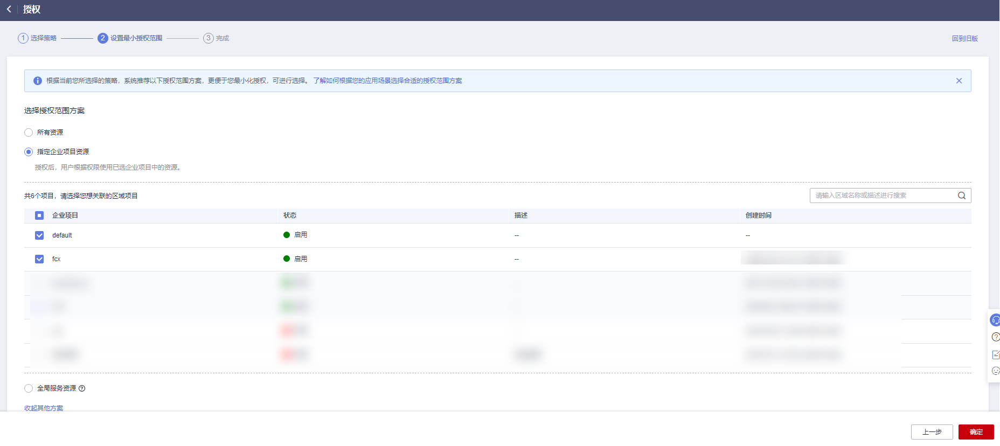

13. 等待授权完成后，在页面左侧目录中，选择“权限管理 ＞ 权限”。

    **图 26**  权限  
    

14. 在权限页面，单击“创建自定义策略”。

    **图 27**  创建自定义策略  
    

15. 根据[云连接权限策略配置示例](云连接权限策略配置示例.md)配置自定义策略相关参数。

    **表 1**  配置自定义策略

    
    <table><thead align="left"><tr id="row11478192611468"><th class="cellrowborder" valign="top" width="32.54545454545455%" id="mcps1.2.3.1.1">
参数

    </th>
    <th class="cellrowborder" valign="top" width="67.45454545454545%" id="mcps1.2.3.1.2">
说明

    </th>
    </tr>
    </thead>
    <tbody><tr id="row747912634613"><td class="cellrowborder" valign="top" width="32.54545454545455%" headers="mcps1.2.3.1.1 ">
策略名称

    </td>
    <td class="cellrowborder" valign="top" width="67.45454545454545%" headers="mcps1.2.3.1.2 ">
自定义策略的名称。

    </td>
    </tr>
    <tr id="row444192861910"><td class="cellrowborder" valign="top" width="32.54545454545455%" headers="mcps1.2.3.1.1 ">
策略配置方式

    </td>
    <td class="cellrowborder" valign="top" width="67.45454545454545%" headers="mcps1.2.3.1.2 "><ul id="ul08251335122420"><li>可视化视图（推荐）</li><li>JSON视图</li></ul>
    </td>
    </tr>
    <tr id="row1158131014423"><td class="cellrowborder" valign="top" width="32.54545454545455%" headers="mcps1.2.3.1.1 ">
策略内容

    </td>
    <td class="cellrowborder" valign="top" width="67.45454545454545%" headers="mcps1.2.3.1.2 "><ul id="ul20675426173614"><li>勾选“允许”</li><li>云服务：云连接</li><li>操作：<ul id="ul202011731152614"><li>只读：勾选“cc:networkInstances:get”、“cc:interRegionBandwidths:get”、“cc:cloudConnectionRoutes:get”</li><li>写：勾选
“cc:networkInstances:create”

    
“cc:interRegionBandwidths:update”

    
“cc:networkInstances:delete”

    
“cc:interRegionBandwidths:create”

    
“cc:interRegionBandwidths:delete”

    
“cc:networkInstances:update”

    </li><li>列表：勾选
“cc:cloudConnectionRoutes:list”

    
“cc:networkInstances:list”

    
“cc:interRegionBandwidths:list”

    </li></ul>
    </li></ul>
    </td>
    </tr>
    </tbody>
    </table>

16. 单击“确定”。
17. 重复步骤[3](#li5905851155517)到步骤[7](#li39055513552)。
18. 根据名称搜索已创建的自定义策略。
19. 勾选自定义策略，单击“下一步”。
20. 单击“展开其他方案”。
21. 选择“全局服务资源”，单击“确定”。

    > **说明：** 
    >如果当前子帐户不包含VPC资源相关权限，可以为用户组再配置一个“CC Network Depend QueryAccess”权限，最小授权范围请选择“所有资源”。
    >可以在用户组授权记录中查看相关授权信息。
    >**图 28**  IAM项目视图授权记录  
    >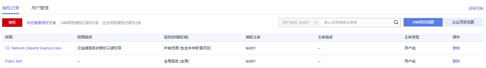
    >**图 29**  企业项目视图授权记录  
    >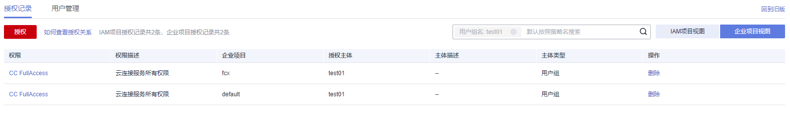

