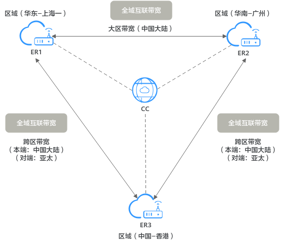

# 全域互联带宽概述

全域互联带宽（Global Connection Bandwidth）通过绑定云上的连接实例，从而控制连接实例在云内骨干网络的通信速率。

> **说明：** 
>-   在云连接服务中，全域互联带宽主要用于绑定企业路由器场景的云连接实例。

全域互联带宽根据连接范围大小，分为不同类型，连接范围由小到大依次为城域带宽、大区带宽、跨区带宽，云连接服务主要涉及大区带宽和跨区带宽，具体说明如下：

**表 1**  ER场景的云连接可用的全域互联带宽说明

<table><thead align="left"><tr id="zh-cn_topic_0000001231298638_row19744103020336"><th class="cellrowborder" valign="top" width="8.1%" id="mcps1.2.5.1.1">
类型

</th>
<th class="cellrowborder" valign="top" width="13.63%" id="mcps1.2.5.1.2">
支持绑定的实例

</th>
<th class="cellrowborder" valign="top" width="35.83%" id="mcps1.2.5.1.3">
使用说明

</th>
<th class="cellrowborder" valign="top" width="42.44%" id="mcps1.2.5.1.4">
使用场景

</th>
</tr>
</thead>
<tbody><tr id="zh-cn_topic_0000001231298638_row1174523033318"><td class="cellrowborder" valign="top" width="8.1%" headers="mcps1.2.5.1.1 ">
大区带宽

</td>
<td class="cellrowborder" valign="top" width="13.63%" headers="mcps1.2.5.1.2 ">
云连接

</td>
<td class="cellrowborder" valign="top" width="35.83%" headers="mcps1.2.5.1.3 ">
大区带宽：用于连通同一个大区内的云内骨干网络。大区分为中国大陆、亚太和南非等，比如华东-上海一和华南-广州均属于中国大陆大区，详细信息请参见<a href="https://support.huaweicloud.com/productdesc-cc/cc_01_0003.html" target="_blank" rel="noopener noreferrer">大区和区域的对应关系</a>。

</td>
<td class="cellrowborder" valign="top" width="42.44%" headers="mcps1.2.5.1.4 ">
使用大区带宽时，CC连接的本端和对端实例（ER）所在区域必须属于同一个大区。

<a href="#zh-cn_topic_0000001231298638_section610819446614">大区/跨区带宽使用场景（云连接）</a>

</td>
</tr>
<tr id="zh-cn_topic_0000001231298638_row274553033318"><td class="cellrowborder" valign="top" width="8.1%" headers="mcps1.2.5.1.1 ">
跨区带宽

</td>
<td class="cellrowborder" valign="top" width="13.63%" headers="mcps1.2.5.1.2 ">
云连接

</td>
<td class="cellrowborder" valign="top" width="35.83%" headers="mcps1.2.5.1.3 ">
跨区带宽：用于连通不同大区内的云内骨干网络。大区分为中国大陆、亚太和南非等，比如华东-上海一和中国-香港位于不同的大区内，详细信息请参见<a href="https://support.huaweicloud.com/productdesc-cc/cc_01_0003.html" target="_blank" rel="noopener noreferrer">大区和区域的对应关系</a>。

</td>
<td class="cellrowborder" valign="top" width="42.44%" headers="mcps1.2.5.1.4 ">
使用大区带宽时，CC连接的本端和对端实例（ER）所在区域属于不同的大区。

<a href="#zh-cn_topic_0000001231298638_section610819446614">大区/跨区带宽使用场景（云连接）</a>

</td>
</tr>
</tbody>
</table>

## 大区/跨区带宽使用场景（云连接）

本示例中，以云连接中接入ER为例：

-   连接ER1和ER2：ER1位所在区域为华东-上海一，ER2所在区域为华南-广州，华东-上海一和华南-广州都属于中国大陆大区，因此连接ER1和ER2的全域互联带宽应该选择大区带宽。
-   连接ER1和ER3：ER1位所在区域为华东-上海一，ER3所在区域为中国-香港，华东-上海一属于中国大陆大区，中国-香港属于亚太大区，因此连接ER1和ER3的全域互联带宽应该选择跨区带宽。

    -   本端大区：选择ER1所在大区，此处为中国大陆。
    -   对端大区：选择ER3所在大区，此处为亚太。

    > **说明：** 
    >本端也可以选择ER3所在大区，对端选择ER1所在大区，本端和对端不做严格区分，只要确保两端的ER均已接入带宽中即可。

-   连接ER2和ER3：ER2位所在区域为华南-广州，ER3所在区域为中国-香港，华南-广州属于中国大陆大区，中国-香港属于亚太大区，因此连接ER2和ER3的全域互联带宽应该选择跨区带宽。
    -   本端大区：选择ER2所在大区，此处为中国大陆。
    -   对端大区：选择ER3所在大区，此处为亚太。

**图 1**  大区/跨区带宽使用场景（云连接）  

